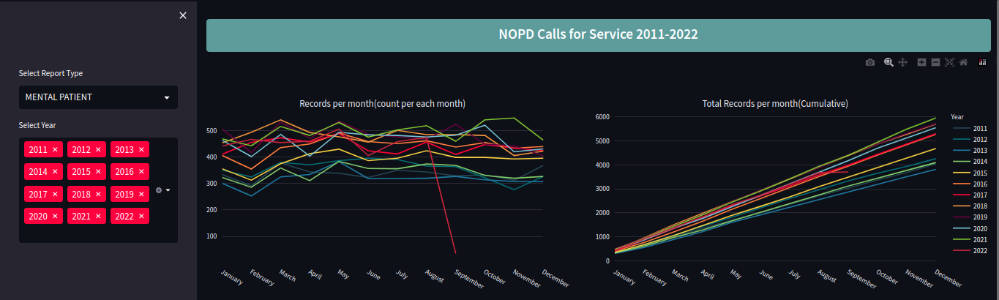

# NOPD Calls Analysis
This repository contains a file, app.py which is a Python code that performs analysis on NOPD (New Orleans Police Department) Calls for Service data from 2011 to 2022. The code utilizes the Streamlit library to create an interactive web application for visualizing and exploring the data. The analysis includes trend analysis, cumulative records per month, and a matrix view of the data.

### Prerequisites
Make sure you have the following libraries installed in your Python environment:
- streamlit
- pandas
- plotly.express
- plotly.graph_objects
- plotly.subplots
You can install these libraries using pip:
     `pip install streamlit pandas plotly`

### Getting Started
To run the code, open terminal and run the following command:
     `streamlit run app.py`
Making sure that app.py and Calls_data.csv is in your current working directory.
  
## Visualizations
Following visuals are included in the analysis dashboard.

- Line plots showing the count of records per month for the selected years.
- Line plot showing the cumulative total records per month for the selected years.
- Matrix view of the data, displaying the count of records per month and year.

The analysis includes filters for Crime nature and Year. Hence, the visualizations will update based on your selections.

## DASHBOARD SNAPSHOT

