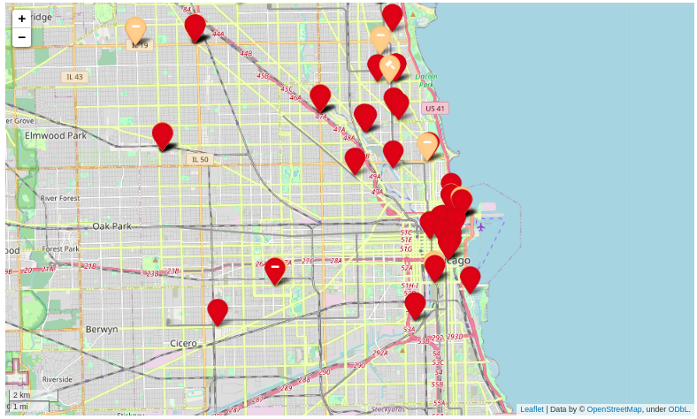
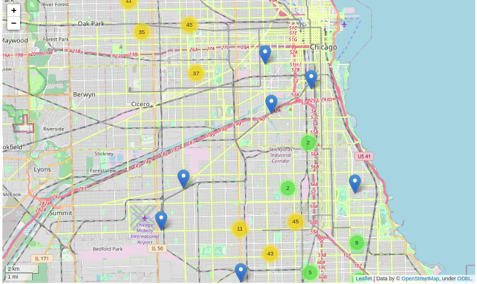
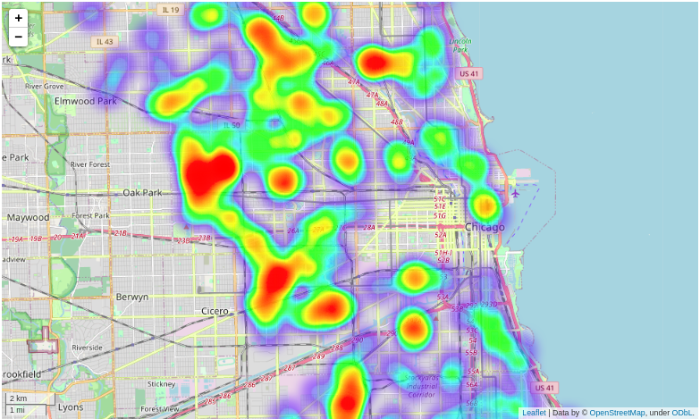

The notebook Crime-Data-Analysis.ipynb uses the dataset of Crimes in the US for the year 2015 and displays maps for visualizing certain maps. Following are the maps that are included;

## MAP 1: MARKER MAP OF CRIMES AT MOVIE THEATRE

The dataset used in this map contains information about crimes that occurred at movie theaters in Chicago in the year 2015. The map displays markers at the corresponding locations of the crimes, with each marker having a unique icon and color based on the crime type and arrest status.

## MAP 2: CLUSTER MAP OF GAMBLING CRIMES

This map displays a cluster of markers for gambling crimes in Chicago in the year 2015. The purpose is to group crimes that are close to each other within clusters to improve visual clarity. Each marker displays a popup with information about the crime.

## MAP 3: HEATMAP OF ARSON CRIMES

This map represents a heatmap visualization of arson crimes in Chicago in the year 2015. Heatmaps are used to highlight areas with higher crime density. The map displays a gradient of colors, with darker shades indicating higher crime density.

## USAGE:

Install the required dependencies(if not installed) using the following command:

      `pip install numpy pandas follium`

Run the file to get required visuals:

      `jupyter-notebook Crime-Location-Analysis.ipynb`

