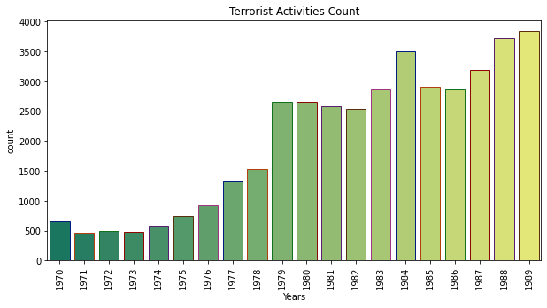
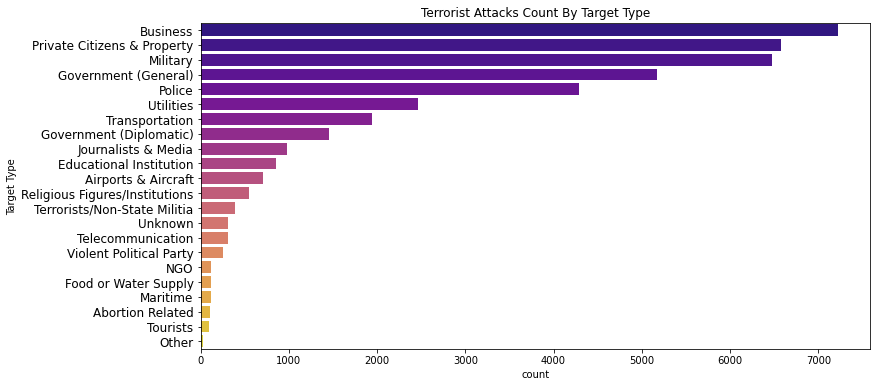
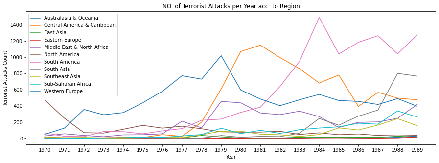
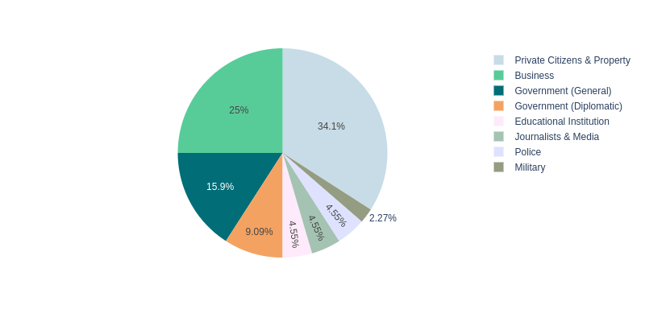
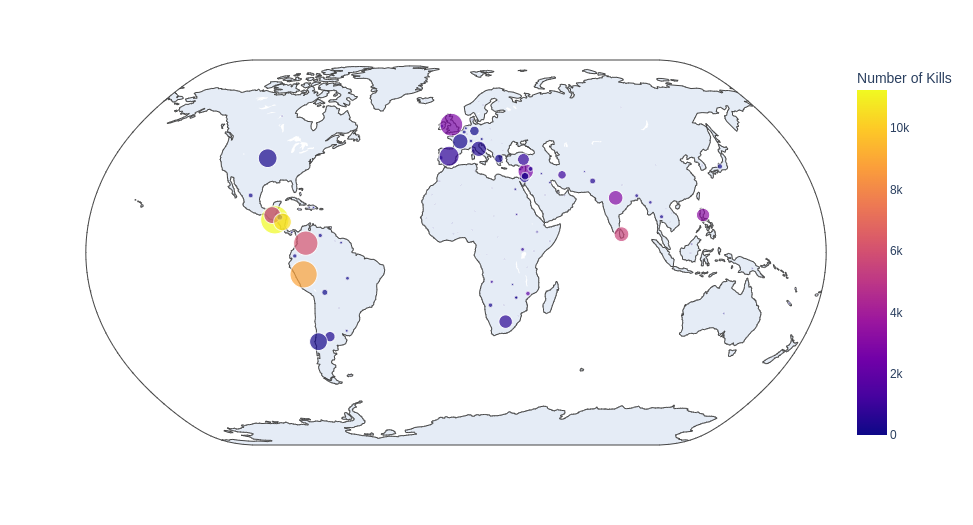

# Global Terrorism Data Analysis

Terrorism Analysis is a data analysis project that explores and visualizes global terrorism data. It utilizes the Global Terrorism Database (GTD) and provides descriptive analysis, charts, and maps to gain insights into terrorist activities.

## Overview

The Terrorism Analysis project focuses on analyzing and visualizing data from the GTD to provide a better understanding of global terrorism trends. It includes various exploratory data analysis techniques, such as descriptive analysis, data visualization using Matplotlib, Seaborn, and Plotly libraries, and interactive maps to visualize the distribution of terrorist attacks worldwide.

## Dependencies

- pandas
- matplotlib
- seaborn
- numpy
- scipy
- plotly

## Usage

1. Make sure you have the GTD dataset file (`GTD.xlsx`) available.

2. Install the required dependencies by running the following command:
    `pip install pandas matplotlib seaborn numpy scipy plotly`

3. Run the Python script to perform the analysis:
    `jupyter-notebook terrorism_analysis.ipynb`

### Project Structure
The project structure is organized as follows:

terrorism_analysis.ipynb: The main Python script that performs the analysis and generates visualizations.
GTD.xlsx: The dataset file containing global terrorism data.
README.md: The documentation file explaining the project and its usage.

### Results
The code performs various analyses and generates visualizations. Here are some of the key findings:

Missing Values: The script identifies missing values in the dataset and handles them by filling them with zero.

Descriptive Analysis: The script provides descriptive analysis of the dataset, including the number of terrorist attacks per year, the number of attacks based on target type, and the number of attacks based on the type of attack.

Visualization: The script generates various visualizations using Matplotlib, Seaborn, and Plotly. It includes bar plots, count plots, pie charts, and choropleth maps to visualize the distribution of attacks, kills, and affected regions/countries.

Summary: The script summarizes the most affected regions, countries, and the two biggest attacks with the highest casualties.

### Some Graphs from Notebook:

