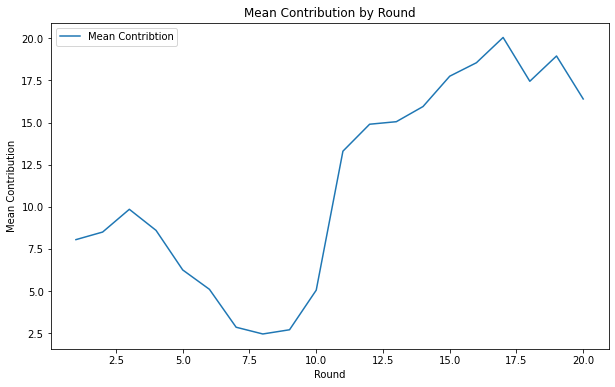
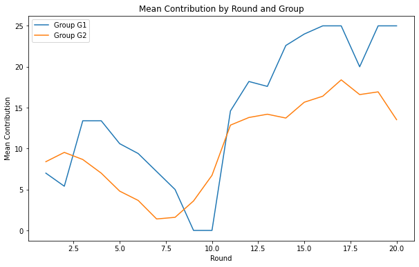
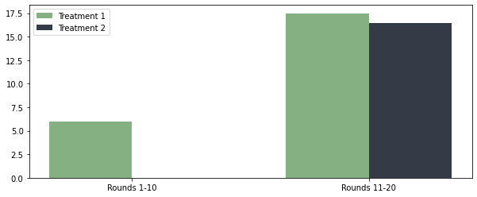
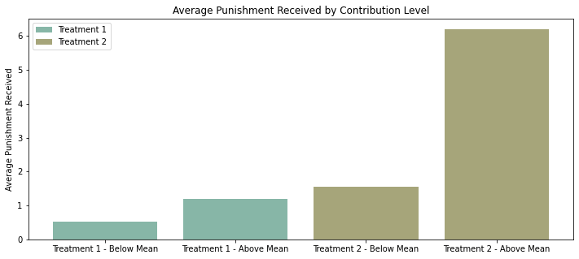
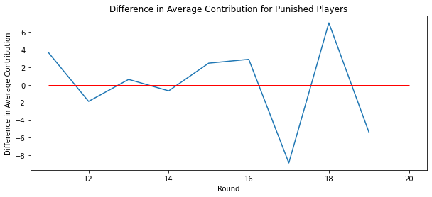

## Experiment Report
This experiment report analyzes the data from an experiment involving two groups of participants over 20 rounds. The goal is to answer several research questions and gain insights into the participants' behavior and the effects of punishment on contributions. The analysis is performed using Python and various data analysis and visualization libraries.

## Research Questions
- Learning Over Rounds: The first question aims to determine if there was any learning observed over the 10 rounds of the experiment. To answer this question, a line plot is created to visualize the mean contribution for each round.

- Effect of Punishment: The second question explores whether contributions were higher in the treatment with punishment compared to the treatment without punishment. Specifically, it compares the contributions in the first and last five rounds with and without punishment.

- Norm for Contributions: The third question investigates whether there was a norm for contributions, such that participants who contributed less than the group mean were punished more. This analysis involves comparing the punishment received by participants based on their contribution level.

- Reaction to Punishment: The fourth question examines the reaction of punished individuals. It analyzes whether participants increased or decreased their contribution in the round following a punishment.

- Classification and Payoffs: The final question classifies participants into two groups: punishers and non-punishers. The payoffs of each group, taking into account the cost of punishment, are compared to determine if there is a difference.

### Code Description
The code in the Experiment-Report.ipynb notebook performs the analysis and generates visualizations for the research questions. Here is a breakdown of the code:

1. Data Loading: The code begins by loading the experiment data from an Excel file using the pandas library. The loaded DataFrame is displayed to provide an overview of the data structure.

2. Learning Over Rounds: The code calculates the mean contribution for each round and creates a line plot to visualize the trend of learning over rounds.

3. Effect of Punishment: The code separates the data into two treatment groups: Treatment 1 (no punishment) and Treatment 2 (punishment permitted). The average contributions for each treatment in the first and last five rounds are calculated and plotted on a grouped bar graph.

4. Norm for Contributions: The code compares the punishment received by participants who contributed below and above the mean for each treatment. It calculates the average punishment received and visualizes it using a bar chart.

5. Reaction to Punishment: The code filters the data to include only rounds where punishment was received. It calculates the average contribution for participants punished in the current round and the next round. The difference in average contribution is plotted to analyze the reaction to punishment.

6. Classification and Payoffs: The code classifies participants into punishers and non-punishers based on whether they received punishment. It calculates the average payoffs for both groups, considering the cost of punishment, and visualizes the results using a bar chart.

### Results and Interpretation
The results of the analysis are as follows:

- `Learning Over Rounds:` The line plot of mean contribution over rounds indicates a trend. Initially, there is an increase in learning from Round 1 to Round 3, followed by a decline from Round 3 to Round 8. Subsequently, learning increases significantly until Round 17, with a slight decline afterward.

- `Effect of Punishment:` The bar graph comparing contributions in rounds with and without punishment shows that contributions were higher in Treatment 1 (no punishment) than in Treatment 2 (punishment permitted) during both the first and last five rounds. This suggests that the presence of punishment had a negative effect on contributions in both round ranges.

- `Norm for Contributions:` The bar chart comparing the punishment received by contributors. It seems to be a norm for contributions in both treatments, where those who contribute less than the mean are punished more.

- `Reaction to Punishment:` The difference in average contribution is determined to be zero/positive/negative, to evaluate participant's performance.

- `Classification and Payoffs:` The average payoff for punishers is compared to the average payoff for non-punishers. The resultant bar chart tells that punishment did not seems effective for the players' contribution in the experiment.

## Usage

1. Make sure to have the data file available with you.

2. Install the required dependencies by running the following command:
   `pip install pandas matplotlib seaborn numpy scipy plotly`

3. Run the Python script to perform the analysis:
   `jupyter-notebook Experiment-Report.ipynb`